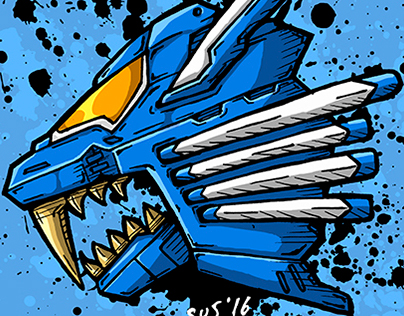

  

<h1 align="center">Zoidsdex</h1>

¡Bienvenido a Zoidsdex! Esta es una enciclopedia digital que recopila información sobre los emocionantes Zoids de la franquicia. Similar a una Pokédex en el mundo de Pokémon, esta Zoidex te permitirá explorar y aprender sobre todas las maravillosas criaturas mecánicas que existen en el universo de Zoids.

---

## Información General

Zoidsdex es una iniciativa creada por [Tu Nombre] para proporcionar a los fans de Zoids una fuente completa de información sobre los Zoids. Aquí encontrarás detalles sobre cada Zoid, desde su nombre y tipo hasta su historia en las series, habilidades especiales y más.

---

## Características

- Lista completa de todos los Zoids de la franquicia.
- Descripciones detalladas de cada Zoid, incluyendo datos técnicos y antecedentes.
- Categorización de Zoids por tipos, clases y más.
- Imágenes de alta calidad para cada Zoid.
- Búsqueda y navegación intuitiva.
- Actualizaciones regulares para incluir nuevos Zoids.

---

## Instalación

1. Clona o descarga este repositorio.
2. Abre el archivo `index.html` en tu navegador web.

---

## Uso

1. Explora la lista de Zoids disponibles.
2. Haz clic en un Zoid para ver su información detallada.
3. Utiliza las opciones de búsqueda y categorización para encontrar Zoids específicos.
4. Disfruta aprendiendo sobre tus Zoids favoritos.

---

Este proyecto es un trabajo en curso, y esperamos que sea de utilidad para todos los fans de Zoids. ¡Gracias por tu interés y apoyo!
